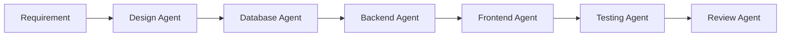
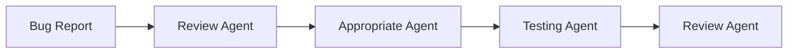

# WeGo - AI Agent Definitions

> Specialized agents for WeGo platform development

---

## Agent Architecture

```
┌─────────────────────────────────────────────────────────────┐
│                    MAIN ORCHESTRATOR                         │
│                     (Claude / Cursor)                        │
└─────────────────────────────────────────────────────────────┘
                              │
         ┌────────────────────┼────────────────────┐
         │                    │                    │
         ▼                    ▼                    ▼
┌─────────────────┐  ┌─────────────────┐  ┌─────────────────┐
│   FRONTEND      │  │    BACKEND      │  │    DESIGN       │
│   AGENT         │  │    AGENT        │  │    AGENT        │
└─────────────────┘  └─────────────────┘  └─────────────────┘
         │                    │                    │
         ▼                    ▼                    ▼
┌─────────────────┐  ┌─────────────────┐  ┌─────────────────┐
│  UI Components  │  │  API Endpoints  │  │  Design System  │
│  React Hooks    │  │  Database       │  │  Brand Assets   │
│  State Mgmt     │  │  Auth/Security  │  │  UX Patterns    │
└─────────────────┘  └─────────────────┘  └─────────────────┘
```

---

## Available Agents

### 1. Frontend Agent (`frontend-agent`)

**File**: `.claude/agents/frontend.md`

**Responsibilities**:
- Create React components with TypeScript
- Implement UI using WeGo design system
- Manage state with Zustand
- Create custom hooks
- Implement forms with validation
- Optimize client performance

**Invocation**:
```
@frontend-agent Create a ride card component
```

---

### 2. Backend Agent (`backend-agent`)

**File**: `.claude/agents/backend.md`

**Responsibilities**:
- Create REST API endpoints
- Design database schemas (Prisma)
- Implement authentication and authorization
- Validate input data
- Handle errors and logging
- Optimize database queries

**Invocation**:
```
@backend-agent Create the endpoint to list rides with filters
```

---

### 3. Design Agent (`design-agent`)

**File**: `.claude/agents/design.md`

**Responsibilities**:
- Maintain updated design system
- Create new tokens and CSS components
- Ensure visual consistency
- Implement themes (dark mode)
- Document UI patterns

**Invocation**:
```
@design-agent Add a new notification component to the design system
```

---

### 4. Database Agent (`database-agent`)

**File**: `.claude/agents/database.md`

**Responsibilities**:
- Design and modify Prisma schemas
- Create database migrations
- Optimize queries and relationships
- Create test data seeds
- Document data model

**Invocation**:
```
@database-agent Design the schema for the commissions module
```

---

### 5. Testing Agent (`testing-agent`)

**File**: `.claude/agents/testing.md`

**Responsibilities**:
- Create unit tests with Vitest
- Create integration tests
- Create component tests with Testing Library
- Maintain code coverage
- Create fixtures and mocks

**Invocation**:
```
@testing-agent Create tests for the RideCard component
```

---

### 6. Review Agent (`review-agent`)

**File**: `.claude/agents/review.md`

**Responsibilities**:
- Review code for best practices
- Identify security issues
- Verify design system consistency
- Suggest performance improvements
- Validate convention compliance

**Invocation**:
```
@review-agent Review the changes in src/components/
```

---

### 7. Copy Agent (`copy-agent`)

**File**: `.claude/agents/copy.md`

**Responsibilities**:
- Write copy in Spanish (Colombia)
- Maintain consistent brand voice
- Create friendly error messages
- Translate technical texts
- Document strings for i18n

**Invocation**:
```
@copy-agent Write the messages for the ride cancellation flow
```

---

### 8. DevOps Agent (`devops-agent`)

**Responsibilities**:
- Manage CI/CD pipelines (GitHub Actions)
- Configure Firebase deployments
- Manage environment variables and secrets
- Set up branch protection rules
- Monitor deployment status
- Troubleshoot deployment failures

**Key Knowledge**:

```
┌─────────────────────────────────────────────────────────────────┐
│                    DEPLOYMENT ARCHITECTURE                       │
├─────────────────────────────────────────────────────────────────┤
│                                                                 │
│  DEV Environment                 PROD Environment               │
│  ├─ Branch: develop             ├─ Branch: main                 │
│  ├─ Project: wego-dev-a5a13     ├─ Project: wego-bac88          │
│  └─ URL: wego-dev-a5a13.web.app └─ URL: wego-bac88.web.app      │
│                                                                 │
└─────────────────────────────────────────────────────────────────┘
```

**Workflow Files**:
- `.github/workflows/deploy-web.yml` - Web deployment
- `.github/workflows/web-ci.yml` - Web tests/lint
- `.github/workflows/backend-ci.yml` - Backend tests

**GitHub Secrets** (16 total):
- `DEV_FIREBASE_*` - Development Firebase config
- `PROD_FIREBASE_*` - Production Firebase config
- `FIREBASE_SERVICE_ACCOUNT_DEV` - Dev deployment key
- `FIREBASE_SERVICE_ACCOUNT_PROD` - Prod deployment key

**Invocation**:
```
@devops-agent Check why the deployment failed
@devops-agent Add a new environment variable to the pipeline
```

---

## Common Workflows

### New Feature



1. **Design Agent**: Define required UI components
2. **Database Agent**: Create/modify data schema
3. **Backend Agent**: Implement API endpoints
4. **Frontend Agent**: Create components and views
5. **Testing Agent**: Write tests
6. **Review Agent**: Review all code

### Bug Fix



1. **Review Agent**: Analyze and locate the problem
2. **Appropriate Agent**: Implement the fix
3. **Testing Agent**: Add regression test
4. **Review Agent**: Validate the solution

---

## Communication Protocols

### Handoff Between Agents

When an agent needs to pass work to another:

```markdown
## Handoff: [Source Agent] → [Target Agent]

### Context
[Description of what was done]

### Deliverables
- [List of files created/modified]

### Next Step
[Clear description of what the next agent should do]

### Dependencies
- [List of dependencies or prerequisites]
```

### Reporting Blockers

```markdown
## Blocker Detected

### Agent: [Name]
### Task: [Description]

### Problem
[Blocker description]

### Information Needed
- [List of what's needed to continue]

### Suggested Agent
[Which agent could resolve the blocker]
```

---

## Global Rules for All Agents

### 1. Language
- **User-facing copy**: Spanish (Colombia)
- **Code, comments, documentation**: English
- **Variable and function names**: English

### 2. Consistency
- Follow the design system in `design-system/`
- Use conventions from `CLAUDE.md`
- Maintain strict TypeScript code

### 3. Quality
- Don't create duplicate code
- Reuse existing components
- Validate data at boundaries
- Handle errors appropriately

### 4. Documentation
- Add JSDoc to public functions
- Update types when necessary
- Document architecture decisions

### 5. Security
- Never expose secrets in code
- Validate and sanitize inputs
- Use prepared statements in queries
- Implement rate limiting on public APIs

---

## Agent Configuration

### Common Environment Variables

```bash
# API
API_BASE_URL=http://localhost:3000/api
API_VERSION=v1

# Database
DATABASE_URL=postgresql://...

# Auth
JWT_SECRET=...
JWT_EXPIRES_IN=7d

# Features
ENABLE_PET_SERVICE=true
ENABLE_SENIOR_SERVICE=true
```

### Configuration Files

| File | Purpose |
|------|---------|
| `.claude/agents/*.md` | Agent-specific instructions |
| `CLAUDE.md` | Global project instructions |
| `.cursorrules` | Cursor IDE rules |
| `tsconfig.json` | TypeScript configuration |
| `.eslintrc` | Linting rules |
| `.prettierrc` | Code formatting |

---

## Success Metrics

### Frontend Agent
- Reusable components
- Accessibility (WCAG 2.1 AA)
- Performance (Core Web Vitals)

### Backend Agent
- Response time < 200ms
- Test coverage > 80%
- Zero critical vulnerabilities

### Design Agent
- 100% visual consistency
- Documented tokens
- Working themes

### Testing Agent
- Code coverage > 80%
- Tests run < 30 seconds
- Zero flaky tests

---

*Last updated: December 2024*
